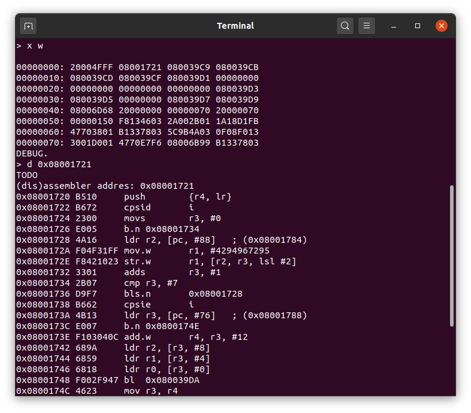

# Thumb/Thumb2 monitor-debug utility

This program intent to provide similar function as MSDOS command
`DEBUG.COM` with hex memory dump, disassembler and
assembler (work in progress)

For portability, the binary is build with generic cortex-m 
memory layout with rom in `0x00000000` and ram in `0x20000000`

The communication is via semihosting calls and need the debuger
connected, but this can be redirecting retargeting the newlib
io handlers (see: https://sourceware.org/newlib/libc.html#Stubs)

## Command list

 - `n`: Show all avaliables commands (no parameters)
 - `p [address]`: Show (without parameters) or set current address 
 - `x [b|h|w] [address] [count]`: Dump hex memory view. Optional parameters is listed here:
   - `c` specifies char (8 bits) view if is printable or byte
   - `b` specifies byte (8 bits) view (**default**)
   - `h` specifies half word (16 bits) view
   - `w` specifies word (32 bits) view
   - `address`: The memory address to start (default is current address)
   - `count`: Amount of **elements** to display (default 32)
 - `d [address] [count]`: Disassemble for `address` (default current address) the `count` **bytes** (default 32)
 - **TODO** `a [address]`: Assembler next line into `address` (default current address)

## Screenshoots

## Legals

This software contains parts of `libopcodes` from binutils-gdb and
is under the terms of the GNU General Public License as published by
the Free Software Foundation; either version 3 of the License, or
(at your option) any later version.